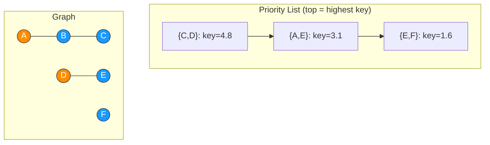
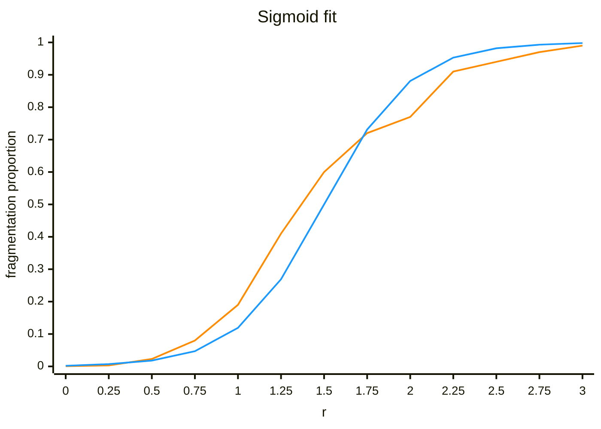

# Graph Generation

Greedy edge growth on a fixed vertex set, ranked by a field-based
priority score shaped by a special subset $S$.

## Formalization

### Graph

- **Vertices**
  - pairwise-distinct positions

$$V\subseteq\{0,\dots,L\}^2\cap\mathbb N^2,\quad |V|=n$$

- **Edges**
  - unordered
  - no self-loops
  - no duplicates

$$E\subseteq\binom V2$$

- **Edge weight**

$$w(u,v) = \lVert u-v\rVert_2$$

- **Sparsity**
  - control of target edge count
  - cap for $m > \binom n2$

$$r\in\mathbb R_+,\quad m=\lfloor rn\rfloor$$
$$|E| = \min(m,\binom n2)$$

- **Special subset**

$$S\subseteq V,\quad |S|=k,\quad 0\le k\le n$$

### Components

- **Root**
  - Distinct-Set-Union root of $v$

$$\rho(v)$$

- **Special subset**
  - members of $\rho$'s component

$$C(\rho) = \{v\in V\mid\text{parent}(v)=\rho\}$$

- **Merge**

$$C(\rho_{\text{new}}) = C(\rho_1)\cup C(\rho_2)$$

### Field

- **Field strength**
  - diminishing returns as component absorbs more of $S$
  - $C(\rho(v))=\emptyset$ = strength $0$ = no contribution

```math
\lambda(v,x) = \begin{cases}
\lambda & \text{component}(v) = \text{component}(x)\\
1 & \text{otherwise}
\end{cases}
```

$$\text{str}(v,x) = \sqrt{\lambda(v,x)\cdot|C(v)|}$$

- **Field value**
  - Gaussian bump around vertex, scaled with amount of connected special members
  - $\sigma$ scaled to $L$, fixed per run
  - $\mu_v$ = $v$'s fixed grid position
  - $F_{\rho(v)}(x)\ge 0$ always

```math
\kappa(v) = \begin{cases}
\kappa & v\in S\\
1 & \text{otherwise}
\end{cases}
```

$$F_{\rho(v)}(x) = \kappa(v)\cdot\text{str}(v,x)\cdot \mathcal{N}(x\mid \mu_v,\sigma^2)$$

- **Priority score**
  - symmetric
  - unbounded priority contribution / ranking value

$$\text{key}(\{u,v\}) = F_{\rho(v)}(u) + F_{\rho(u)}(v)$$

## Functionality

### Generation and Visualization

- **Vertices**
  - one dot per vertex
  - fixed grid position, no recomputed/arbitrary layout
- **Edges**
  - one at a time
  - in greedy-acceptance order
- **Recency glow**
  - glow of newly-appeared edges
  - fade over time to the same steady baseline appearance



### Fragmentation Study

- **Trial proportion**
  - across $N$ independent trials at fixed $r$
  - trial true iff all of $S$ shares one root

$$\hat p(r) = \frac1N\sum_{i=1}^N \mathbb{I}\big[\rho(s)\text{ equal }\forall s\in S\big]_i$$

- **Sigmoid fit**
  - fit to $(r,\hat p(r))$ points by minimizing $\sum_i\big(p(r_i)-\hat p(r_i)\big)^2$
  - $r_0$ = estimated fragmentation threshold

$$p(r) = \frac1{1+e^{-k(r-r_0)}}$$

- **Fit example** (illustrative, $k=4$, $r_0=1.5$)
  - sample points = raw noisy $\hat p(r)$ per trial batch
  - blue curve = fitted $p(r)$



## Implementation

### Generation-Algorithm

- **Priority list**
  - candidate pool $\binom V2$, one entry per unordered vertex pair
  - each entry ranked by its current $\text{key}(\{u,v\})$

- **Greedy growth**
  1. highest-ranked entry $\{u,v\}$ from the priority list
  2. $\{u,v\}$ as edge, merge of $\rho(u)$ and $\rho(v)$
  3. re-ranking of all remaining entries incident to $u$ or $v$
  4. iteration until $|E|=m$ or the priority list is exhausted
- **Invariants**
  - accepted pairs are never revisited
  - single edge accepted per iteration

### Fragmentation Study

- **Fit method**
  - gradient descent on $(k,r_0)$
  - minimization of $\sum_i\big(p(r_i)-\hat p(r_i)\big)^2$ over the sigmoid $p(r)$

- **Initialization**
  - $r_0\leftarrow\frac{\min(r)+\max(r)}2$
  - $k\leftarrow 1.0$

- **Per-iteration update**
  1. predicted value per point

$$p(r_i) = \frac1{1+e^{-k(r_i-r_0)}}$$

  2. error-slope term per point

$$g_i = 2\big(p(r_i)-\hat p(r_i)\big)\cdot p(r_i)\big(1-p(r_i)\big)$$

  3. gradient accumulation over all $N$ points

$$\nabla_k = \sum_i g_i\cdot(r_i-r_0), \quad \nabla_{r_0} = \sum_i g_i\cdot(-k)$$

  4. parameter update, learning rate $\eta$ scaled by point count $N$

$$k\leftarrow k-\frac{\eta}N\nabla_k, \quad r_0\leftarrow r_0-\frac{\eta}N\nabla_{r_0}$$

- **Stopping criteria**
  - $\lVert(\nabla_k,\nabla_{r_0})\rVert<$ tolerance, or
  - fixed maximum iteration count reached
</content>
</invoke>
