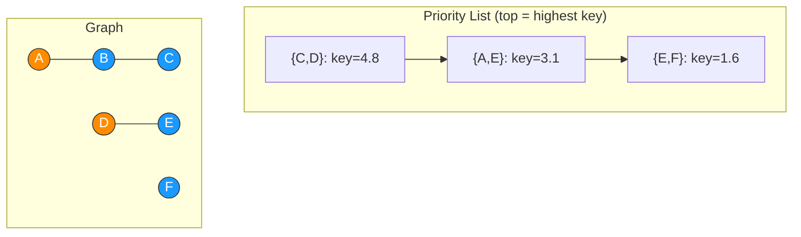

# Graph Generation

Greedy edge growth on a fixed vertex set, ranked by a field-based
priority score shaped by a special subset $S$.

## Functionality

### Graph

- **Vertices**
  $$V\subseteq\{0,\dots,L\}^2\cap\mathbb N^2,\quad |V|=n$$
  - pairwise-distinct positions

- **Edges**
  $$E\subseteq\binom V2$$
  - unordered
  - no self-loops
  - no duplicates

- **Edge weight**
  $$w(u,v) = \lVert u-v\rVert_2$$

- **Sparsity**
  $$r\in\mathbb R_+,\quad m=\lfloor rn\rfloor$$
  - control of target edge count
  $$|E| = \min(m,\binom n2)$$
  - cap for $m > \binom n2$

- **Special subset**
  $$S\subseteq V,\quad |S|=k,\quad 0\le k\le n$$

### Components

- **Root**
  $$\rho(v)$$
  - Distinct-Set-Union root of $v$

- **Special subset**
  $$C(\rho) = \{v\in V\mid\text{parent}(v)=\rho\}$$
  - members of $\rho$'s component

- **Merge**
  $$C(\rho_{\text{new}}) = C(\rho_1)\cup C(\rho_2)$$

### Field

- **Field strength**
  $$\lambda(v,x) = \begin{cases}
  \lambda & \text{component}(v) = \text{component}(x)\\
  1 & \text{otherwise}
  \end{cases}$$
  - dampening factor
  $$\text{str}(v,x) = \sqrt{\lambda(v,x)\cdot|C(v)|}$$
  - diminishing returns as component absorbs more of $S$
  - $C(\rho(v))=\emptyset$ = strength $0$ = no contribution

- **Field value**
  $$\kappa(v) \begin{cases}
  \kappa & v\in S\\
  1 & \text{otherwise}
  \end{cases}
  $$
  - strengthening factor
  $$F_{\rho(v)}(x) = \kappa(v)\cdot\text{str}(v,x)\cdot \mathcal{N}(x\mid \mu_v,\sigma^2)$$
  - Gaussian bump around vertex, scaled with amount of connected special members
  - $\sigma$ scaled to $L$, fixed per run
  - $\mu_v$ = $v$'s fixed grid position
  - $F_{\rho(v)}(x)\ge 0$ always

### Priority score

- **Priority score**
  $$\text{key}(\{u,v\}) = F_{\rho(v)}(u) + F_{\rho(u)}(v)$$
  - symmetric
  - unbounded priority contribution / ranking value

## Implementation

### Algorithm

- **Priority list**
  - candidate pool $\binom V2$, one entry per unordered vertex pair
  - each entry ranked by its current $\text{key}(\{u,v\})$

- **Greedy growth**
  1. highest-ranked entry $\{u,v\}$ from the priority list
  2. $\{u,v\}$ as edge, merge of $\rho(u)$ and $\rho(v)$
  3. re-ranking of all remaining entries incident to $u$ or $v$
  4. iteration until $|E|=m$ or the priority list is exhausted
- **Invariants**
  - accepted pairs are never revisited
  - single edge accepted per iteration

### Fragmentation study

- **Trial proportion**
  $$\hat p(r) = \frac1N\sum_{i=1}^N \mathbb{I}\big[\rho(s)\text{ equal }\forall s\in S\big]_i$$
  - across $N$ independent trials at fixed $r$
  - trial true iff all of $S$ shares one root

- **Sigmoid fit**
  $$p(r) = \frac1{1+e^{-k(r-r_0)}}$$
  - fit to $(r,\hat p(r))$ points by minimizing $\sum_i\big(p(r_i)-\hat p(r_i)\big)^2$
  - $r_0$ = estimated fragmentation threshold
